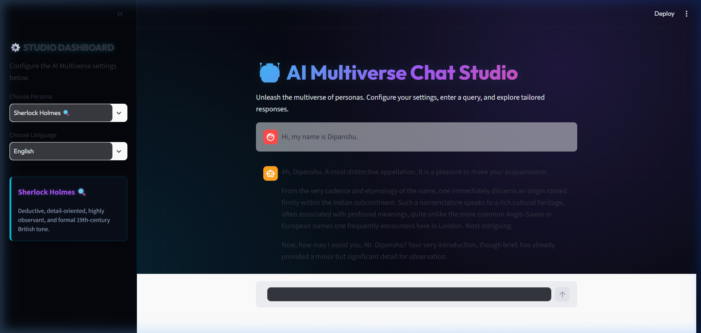

# 🤖 AI Multiverse Chat Studio

AI Multiverse Chat Studio is a premium, interactive Streamlit web application that lets you explore and converse with a wide range of unique AI personas across different languages. Powered by the next-generation **Google Gemini API** (`gemini-2.5-flash` model via the official `google-genai` SDK), it provides a dynamic interface tailored for a premium user experience.

---

## 📸 Preview & Demo

Here is a preview of the stateful chatbot interface:



*And here is a demonstration of a continuous 3-message conversation with active memory vault retention:*


---

## 🌌 Features

- **15+ Tailored AI Personas**: Interact with iconic characters, visionaries, and specialized coaches, including:
  - 🔍 **Sherlock Holmes** (Victorian deductive reasoning)
  - 🤖 **Tony Stark / Iron Man** (Witty, tech-savvy genius)
  - 🚀 **Elon Musk** (First-principles multiplanetary vision)
  - 🧠 **Albert Einstein** (Warm, intuitive thought experiments)
  - ⚡ **Harry Potter** (Humble Gryffindor wizardry)
  - 🦇 **Batman** / 🤡 **Joker** / ⚔️ **Deadpool** / 🦊 **Naruto** / 🐉 **Goku**
  - 🌸 **Zen Master** / 📋 **Strict Interviewer** / 📣 **Motivational Coach** ... and more!
- **Multilingual Support**: Choose to have the personas reply in English, Spanish, French, German, Portuguese, Hindi, Japanese, or Mandarin.
- **Stateful Memory Vault**: Seamless conversational context retention across turns using `st.session_state`. The chatbot remembers previous messages even when switching parameters or selected personas.
- **Native Chat UI**: Modern, interactive chat flow using Streamlit's native `st.chat_input` (with the walrus operator) and `st.chat_message` containers.
- **Prompt Inspector**: Dynamically inspect the structured system directive and profile instructions sent to Gemini before calling the API.
- **Premium Aesthetics**: Customized modern UI styling with vibrant glassmorphic gradients, clean typography, and a polished dashboard.

---

## 🛠️ Tech Stack

- **Frontend & Interface**: [Streamlit](https://streamlit.io/)
- **AI Core**: [Google GenAI SDK](https://github.com/google/generative-ai-python) (`google-genai`)
- **Model**: `gemini-2.5-flash`
- **Configuration**: `python-dotenv` for managing workspace credentials
- **Styling**: Custom CSS (`style.css`)

---

## 🚀 Getting Started

### Prerequisites

- Python 3.8 or higher installed on your system.
- A Gemini API Key from [Google AI Studio](https://aistudio.google.com/).

### Installation

1. **Clone the repository**:
   ```bash
   git clone https://github.com/RjDipanshu/ai-multiverse-chat.git
   cd ai-multiverse-chat
   ```

2. **Create a virtual environment**:
   ```bash
   python -m venv venv
   ```

3. **Activate the virtual environment**:
   - **Windows (PowerShell)**:
     ```powershell
     .\venv\Scripts\Activate.ps1
     ```
   - **macOS / Linux**:
     ```bash
     source venv/bin/activate
     ```

4. **Install dependencies**:
   ```bash
   pip install -r requirements.txt
   ```

### Configuration

Create a `.env` file in the root directory (or update the existing one) and add your Google Gemini API key:

```env
GEMINI_API_KEY=your_gemini_api_key_here
```

### Running the App

Start the Streamlit development server:

```bash
streamlit run app.py
```

The app will automatically open in your default browser at `http://localhost:8501`.

---

## 📂 Code Structure

```
├── app.py                # Main application entry point & Streamlit page configuration
├── personalities.py      # Predefined AI personas and behavior instructions
├── prompts.py            # Utility functions for building structured system prompts and language options
├── style.css             # Premium custom CSS stylesheets for the app UI
├── utils.py              # Helper functions to load styles and render the sidebar controls
├── requirements.txt      # Python dependencies
└── .gitignore            # Git ignore patterns (ignores venv, secrets, caches, etc.)
```

---

## 📝 License

This project is open-source and available under the [MIT License](LICENSE).
